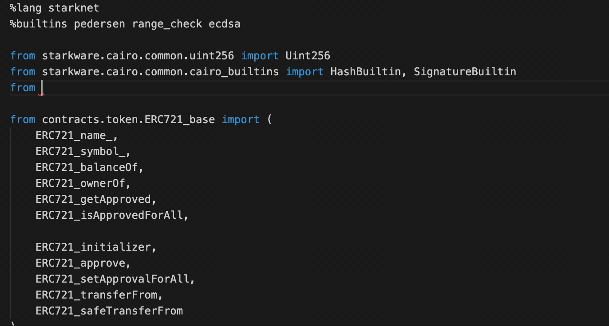

# Cairo Language Server for VS Code

Code assistance when writing [Cairo](https://www.cairo-lang.org/) smart contracts for StarkNet.

Makes use of the [Cairo Language Server](https://github.com/ericglau/cairo-ls).

**Note**: This is an early preview release and is still in active development.

## Features

- Compiler support for .cairo files
- Live diagnostic highlighting for compile errors
- Quick fixes with suggestions provided by Cairo/StarkNet compiler
- Go to definitions for imports
- Code completion for imports

Right-click menu commands using [Nile](https://github.com/OpenZeppelin/nile):
- Nile - Clean
- Nile - Compile all
- Nile - Compile this contract
- Run tests with pytest

## Setup

1. Install Nile by following its [Getting started](https://github.com/OpenZeppelin/nile#getting-started) steps, or follow the [Cairo environment setup steps](https://www.cairo-lang.org/docs/quickstart.html).
3. If using a virtual environment, start VS Code from within that terminal according to the instructions [here](https://www.cairo-lang.org/docs/quickstart.html#visual-studio-code-setup).
4. Install this extension along with [StarkWare's Cairo extension (.vsix file)](https://github.com/starkware-libs/cairo-lang/releases).
5. Open a .cairo file and start editing.
5. If your project's contracts directory is in a subfolder such as `src`, set the folder name using the `sourceDir` setting in your VS Code settings under the Cairo LS section.